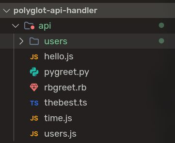
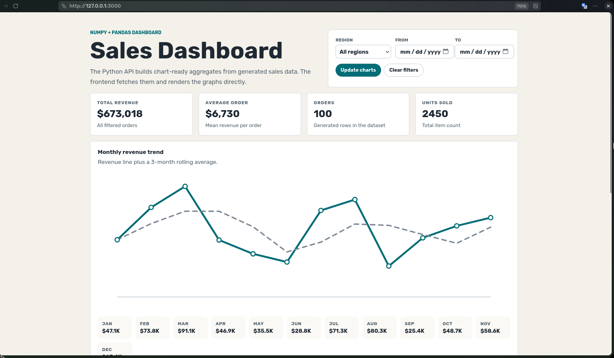
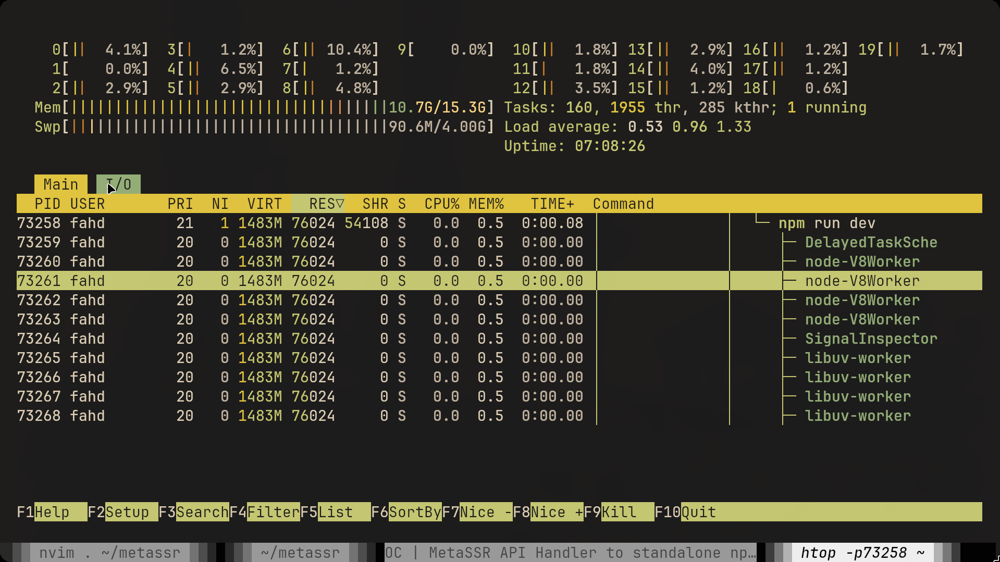

## Quick Recap about MetaSSR

If I would sell it to you, MetaSSR is like Next.js but with Polglot API handlers. Meaning You can have more than one programming language in the backend, sharing the same data, memory, server.

I have a more detailed blog post coming out soon about MetaSSR. Stay tuned.

## What's happening

A huge milestone for MetaSSR: We're doing our first example ("Sales Dashboard")

The initial theme [has been merged](https://github.com/metacall/metassr/pull/183), we're doing a sales dashboard using Python's famous libs **numpy** and **pandas**, the most reliable and most used libs —ever, AFAIK— for statistics.

For the JS endpoint, I still don't have something in mind JS would be good for and justify using it.

But for now, this is actually pretty good, **undeniably faster** than any implementation of a Python backend, because we use Rust to power the server of this app.

(server has 76mb in memory usage, in dev mode)

Next steps I aim to do is to *always* dockerize examples, I want them to be fully reproducible and deployable. I want to lay out a good foundation so that I could encourage people to create and vibecode their own examples of MetaSSR and help improving the project, by battle-testing it with interesting use-cases.

Anyways, I would love to hear feedback on this.

If you got any idea that could be an example, please feel free to contribute a pull request.
