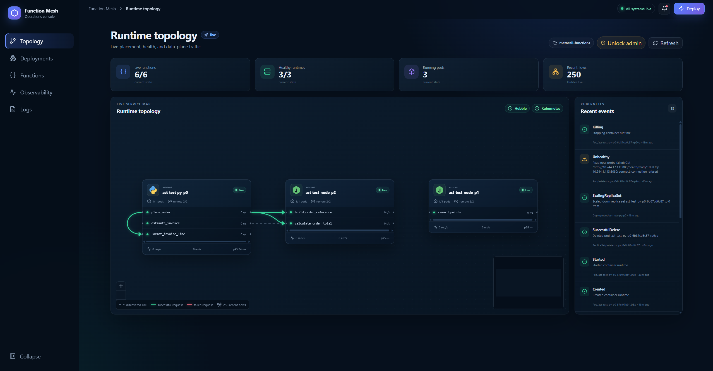
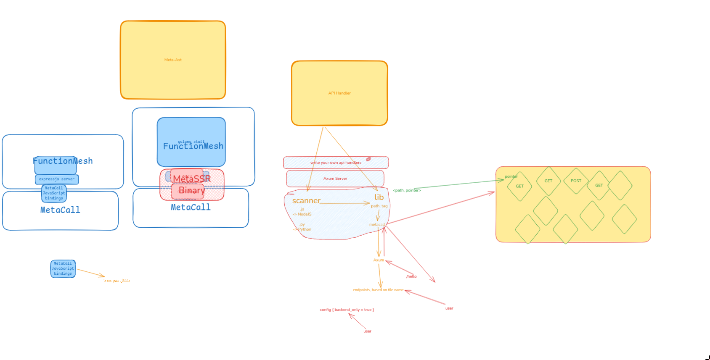

I met with Anas and discussed a few interesting things that'll make MetaSSR usable in one of such interesting usecases
Anas has a GSoC 2026 project in MetaCall like me "[**Function Mesh Implementation**](https://summerofcode.withgoogle.com/programs/2026/projects/X0vuyYHC)"

## The FunctionMesh Project

I would leave the discovery of FunctionMesh project for you to do, but AFAIC this is how I understand it, briefly.

The main idea is: A polyglot app (think Python + NodeJS application) can be deployed in functions, rather than microservices.

This approach, as crazy as it sounds, might be advantageous in more than a way. But again, It's not my concern to explain how FunctionMesh works. I can leave that for Anas, and you can always ping him if you got any concrens.

## The integration

What the meeting was about?
Vicente, MetaCall founder and our Mentor, found that there's a potential of a strong integration between FunctionMesh and MetaSSR.

The idea was: FunctionMesh already uses Express.js as a webserver. Why don't we take advantage of how fast MetaSSR is (I plan on talking about benchmarks really soon on a devlog) and use it instead of express.js (essentially replacing Express with Axum)

The structure is not clear at all for me at this point. For instance, you can see the result excalidraw from the brainstorming between me and [Hossam](https://khe.ro) thinking about this problem.

But I can promise you that i'm working around this idea: I want to get only the backend/server-side part of MetaSSR, to give FunctionMesh the ability to use the api handlers. While still giving FunctionMesh the ability to call my rust MetaCall bindings.

For now, I think that *only* the advantage of migrating the server from Express to Axum is 90% of the performance improvements. And the other 10%, coming from letting FunctionMesh call MetaCall from rust bindings, can wait for later.

I know I know... that's way vague-y .. I still I hope by the end of the week I have found a way out of this. Or at least find myself in a better state.

Will keep you in-touch inshallah.
